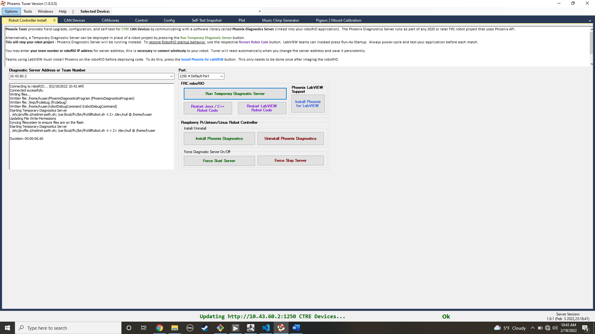
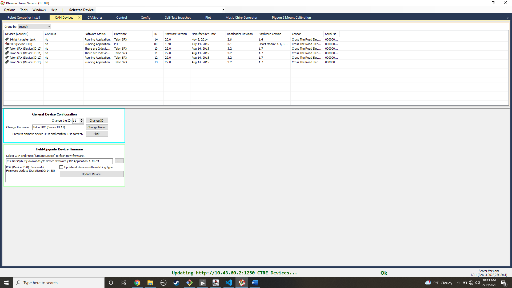

# SAFM 2022 Code

## Setup

- Install [WPILib Suite](https://github.com/wpilibsuite/allwpilib/releases/latest), following the included instructions.
  - VS Code, WPILib Code APIs, SmartDashboard, and other tools
  - Internet is required to first download the Vendor libraries (CTRE/NavX)
- Install [NI FRC Update Suite](http://www.ni.com/download/labview-for-frc-18.0/7841/en/), following the included instructions.
  - FRC Driver Station

## Install Third Party Librariers

1. In VSCode: `CTRL+SHIFT+P` 
2. then type `WPILib: Manage`
3. then go down to `Install New librariers (online)`
4. Paste the following into the dialog box:
`https://maven.ctr-electronics.com/release/com/ctre/phoenix/Phoenix-frc2022-latest.json`

Repeat steps 1 through 3 then paste:
`https://www.kauailabs.com/dist/frc/2022/navx_frc.json`

`https://software-metadata.revrobotics.com/REVLib.json`

## Install the New Command System
1. In VSCode: `CTRL+SHIFT+P` 
2. then type `WPILib: Manage`
3. then go down to `Install New librariers (offline)`
4. Select `new Command`

## Configure Spark Max Controllers

The SPARK MAX Controllers have a really nice config app and documentation. The documentation can be found here: https://docs.revrobotics.com/sparkmax/gs-sm

The hardware client app can be found here: https://docs.revrobotics.com/sparkmax/rev-hardware-client/getting-started-with-the-rev-hardware-client

Connect a USB cable from your PC to the SPARK Max controller. The app will detect this and display the controller. From the app you can program firmware, configure the motor, and configure the CAN ID. **This must be unique from all controllers on the bus.**

## Configure the Talon SRX Controllers

These controllers are a little more difficult. Start at this page:
https://store.ctr-electronics.com/talon-srx/

Download the Phoenix Framework installer and the CTRE Device Firmware. 

After installing the framework you will start the `Phoenix Tuner` application.
 - Set the IP address in the Diagnostic Server Address to `10.TE.AM.2` where TE.AM is the team number: I.E. `10.70.48.2` or `10.43.60.2`.
 - Click `Run Temporary Diagnostic Server`
 - Click on `CAN Devices`
 - Now you can program all of the devices and configure their addresses

## Commands

- The VSCode Build Menu: `CTRL+SHFT+P`
  - Type `WPILib: Build Robot Code`
- VSCode Command Palette: `CTRL+SHFT+P`
  - Auto-fills on commands
- Deploy to the RoboRIO
  - `CTRL+SHIFT+P`
  - Type: `WPILib: Deploy Robot Code`
- Simulate code
  - `CTRL+SHIFT+P`
  - Type: `WPILib: Simulate Robot Code`

# Simulator

I'm still trying to figure out the simulator, but you can test out your control scheme and see how PWM motors respond. The SPARK Max motors don't show up.

# Robots

The idea is we break common code pieces into their own classes, but have two different RobotXXXX classes. Then in Main.java, you can uncomment the robot you want to run.

## Fargo Robot Control

This code currently implements a two motor differential drive chassis using Spark MAX motor controllers. It uses an XBox and an arcade drive.

### Controller 1
The left joystick drives the robot forward/back and left/right.

The harvester is controlled by the right joystick. Up is harvest, down is to push the ball out

The A and B buttons control the arms. Although the direction is still unknown

### Controller 2

The launcher is also configured to use the buttons:
|Button|Description|
|---|---|
|Y | 80% |
|B | 60% |
|A | 40% |

The Left Y axis controls the indexer

The Left and Right bumpers (buttons above the triggers) control the climbing arms.

## Moorhead Robot Control

This code currently implements a two motor differential drive chassis using Spark MAX motor controllers. It uses an XBox and an arcade drive.

The left joystick drives the robot forward/back and left/right. Although I may have things backwards, we will need to test that. 

The other motors are mapped to the D-PAD, Rigth stick, triggers, and bumpers. I don't know
what the motors do, so they are not labeled intelligently. 

## Robot positioning

The motor to gearbox ratio is roughly 8.88. Meaning it takes 8.88 rotations of the motor to route the main shaft one rotation. The wheels are roughly 6 inches in diamter. 
Therefore 8.88 rotations of the motor will move the robot 18.8 inches. Or one rotation of
the motor will move the wheel 2.1 inches. Therefore we want to program the encoder class
with 1/2.1. Now the encoders will tell us exactly how many inches we have moved.

## Autonomous Mode

The Fargo robot has a simple autonomous mode that currently runs the harvester for 5 seconds, then runs the indexer and launcher for 5 seconds. 